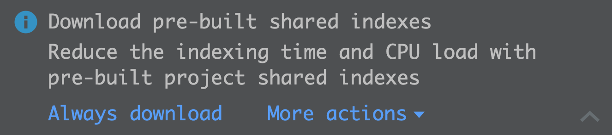
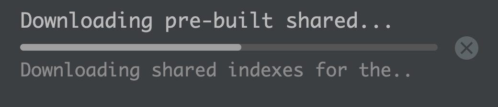

# Troubleshooting JetBrains shared indexes

You may find that your IDE is not downloading the shared index files. Here are some steps you
can use to troubleshoot this.

## IDE version

While shared indexes are generated with cross-platform support, they are not compatible with all versions of the IDE. (1)[^1]

By default, the Docker image will generate indexes for the `2021.3` version of IntelliJ IDEs.
If you are using a different version, you will need to update the build-time variable
[IDE_VERSION](https://github.com/bpmct/jetbrains-indexer/blob/master/image/Dockerfile#L9) and
rebuild the container.

## Missing intellij.yaml

You will need an `intellij.yaml` file in the root of your project in order for your IDE to download indexes.

```yaml
sharedIndex:
  project:
    - url: https://cdn.yoursite.com/project/xyz
```

## Indexes URL Mismatch

The shared index URL in `intellij` must match the URL specified as [INDEXES_CDN_URL](https://github.com/bpmct/jetbrains-indexer#basic-usage) when generating the indexes.

Alternatively, if you manually using `cdn-layout-tool`, must match the `--url` flag.

[^1]: https://www.jetbrains.com/help/idea/shared-indexes.html

## Indexes still slow

Shared indexes perform best when generated by the same IDE you are using it with. For example,
you should use the `bencdr/indexer:webstorm-[intellij-version]` image for WebStorm. Other IDEs
will work, but yield slower results.

As long as you see a message that indexes are being downloaded in your IDE, shared indexes are working as expected.

---

## Resources

- A proper download of shared indexes will show both these messages in the IDE first time:

  
  

  The second screenshot is the actual download. Click on "indexing..." in the bottom toolbar to check. If you don't see this on the first load, you will likely need to troubleshoot.

- The [quickstart](https://github.com/bpmct/jetbrains-indexer#basic-usage) to test with a
  local Python server can help you see HTTP requests. It is OK if requests to `vcs/list.json` fail. A
  successful download of shared indexes will look like this in the server logs:

  ```sh
    ::ffff:127.0.0.1 - - [22/Dec/2021 20:43:14] code 404, message File not found
    ::ffff:127.0.0.1 - - [22/Dec/2021 20:43:14] "GET /project/vcs/list.json.xz?timestamp=1640234594725 HTTP/1.1" 404 -
    ::ffff:127.0.0.1 - - [22/Dec/2021 20:43:14] "GET /project/index.json.xz?timestamp=1640234594741 HTTP/1.1" 200 -
    ::ffff:127.0.0.1 - - [22/Dec/2021 20:43:14] "GET /project/output/shared-index-project-project-675203570796a5ec.ijx.xz HTTP/1.1" 200 -
  ```

- Use `File -> Invalidate Caches` in your IDE to re-download shared indexes.

- To further troubleshoot, you can download, extract, and open the `index.json.xz` file to ensure the project URL is valid and does not 404.
